# Tarea 2 — Microservicios Spring Boot
**Computación en la Nube — Seminario de Ciencias de la Computación B**
**Integrantes**
- Elizalde Maza Jesús Eduardo 321031686
- Peredo López Citlalli Abigail 321161022

**Objetivo:** Entender la programación de microservicios usando las APIs RestTemplate y Feign.

---

## Descripción

Se desarrollaron dos microservicios que se comunican entre sí usando modelos de autos como datos:

- **springboot-servicio-productos** (puerto 8001): Gestiona el catálogo de autos.
- **springboot-servicio-item** (puerto 8002): Consume al servicio de productos y agrega cantidad y cálculo de total.

### Catálogo de autos

| Marca  | Modelo             | Año  | Precio        |
|--------|--------------------|------|---------------|
| GMC    | Acadia             | 2026 | $1,352,900.00 |
| GMC    | Terrain            | 2026 | $802,900.00   |
| Ford   | Escape Híbrida     | 2025 | $801,100.00   |
| Ford   | Territory Híbrida  | 2025 | $719,900.00   |
| Toyota | Corolla Cross HEV  | 2024 | $625,900.00   |
| Toyota | Highlander HEV     | 2024 | $950,900.00   |

---

## Ejecución

Se necesitan **dos terminales** abiertas simultáneamente.

**Terminal 1 — Servicio de Productos (puerto 8001):**
```bash
cd springboot-servicio-productos
mvn spring-boot:run
```

**Terminal 2 — Servicio de Items (puerto 8002):**
```bash
cd springboot-servicio-item
mvn spring-boot:run
```

---

## Endpoints disponibles

### Servicio de Productos (`localhost:8001`)
| Método | Endpoint | Descripción |
|--------|----------|-------------|
| GET | `/listar` | Lista todos los autos |
| GET | `/ver/{id}` | Busca un auto por ID |
| DELETE | `/delete/{id}` | Elimina un auto por ID |

### Servicio de Items (`localhost:8002`)
| Método | Endpoint | Descripción |
|--------|----------|-------------|
| GET | `/listar` | Lista todos los items con cantidad y total |
| GET | `/ver/{id}/cantidad/{cantidad}` | Busca un item con cantidad específica |
| DELETE | `/delete/{id}` | Elimina un item por ID |

---

## Cambiar entre RestTemplate y Feign

En `ItemController.java` cambiar el `@Qualifier` activo:

```java
// Para usar Feign:
@Qualifier("serviceFeign")

// Para usar RestTemplate:
@Qualifier("serviceRestTemplate")
```

---

## Corridas

### Corrida con Feign Client

**ItemController.java con `@Qualifier("serviceFeign")` activo:**

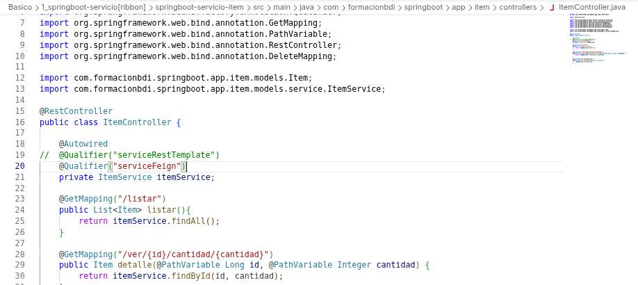

**GET `/listar` — Lista de autos (localhost:8002/listar):**

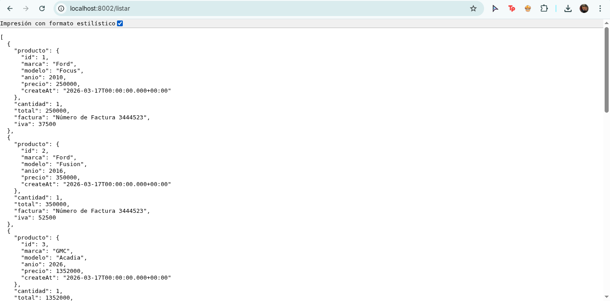

**GET `/ver/1/cantidad/3` — Detalle con cantidad:**

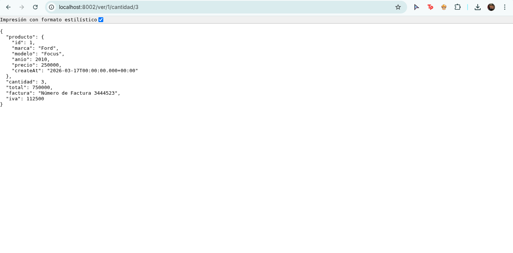

**DELETE `/delete/1` — Eliminar item vía curl:**

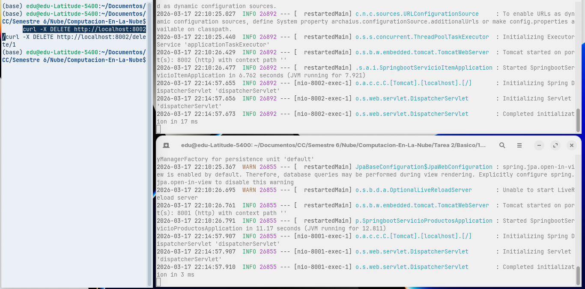

**GET `/listar` después del DELETE — El auto con id 1 ya no aparece:**

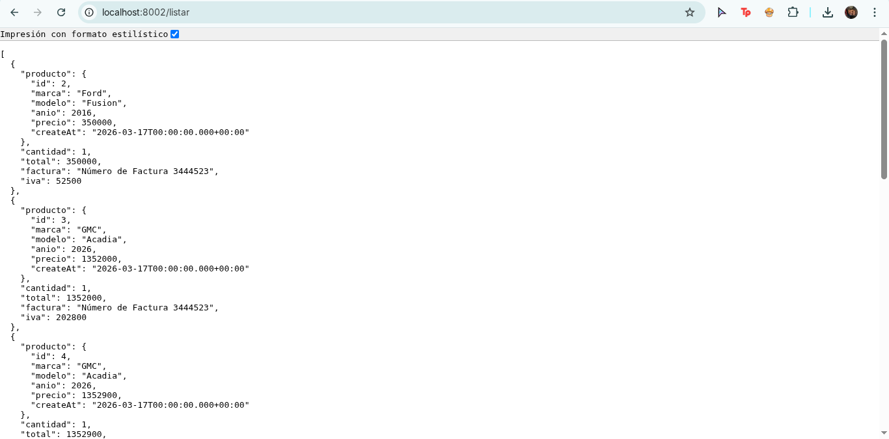

**Consola H2 — Verificación de la tabla antes del DELETE (8 filas):**

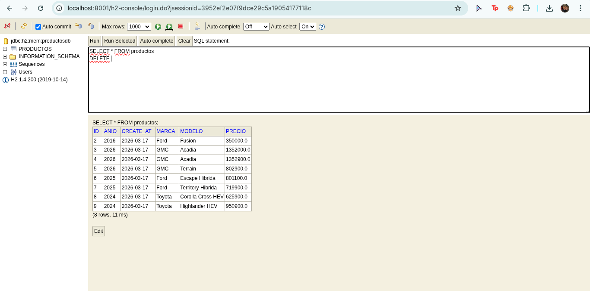

**Consola H2 — Verificación de la tabla después del DELETE (7 filas):**

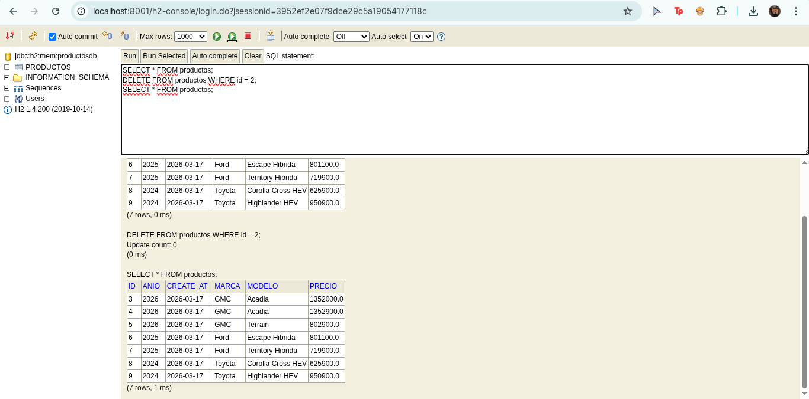

---

### Corrida con RestTemplate

**ItemController.java con `@Qualifier("serviceRestTemplate")` activo:**

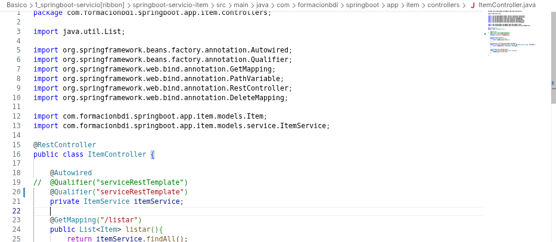

**GET `/listar` — Lista de autos (localhost:8002/listar):**

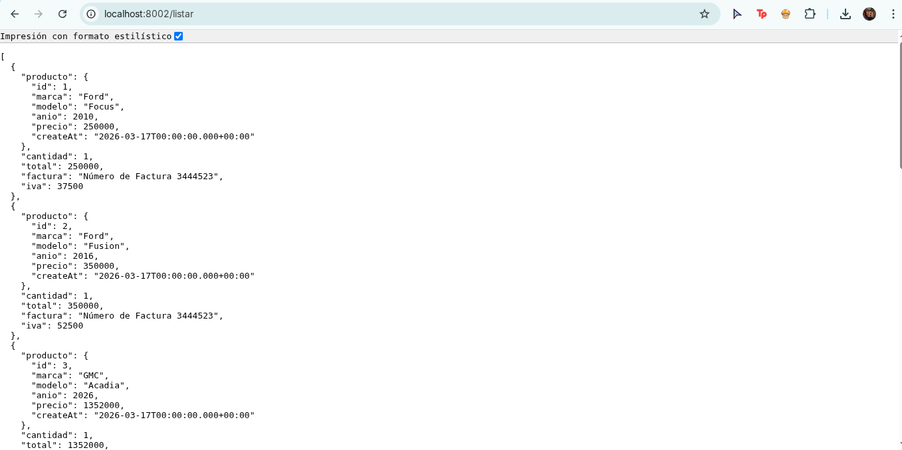

**GET `/ver/1/cantidad/3` — Detalle con cantidad:**

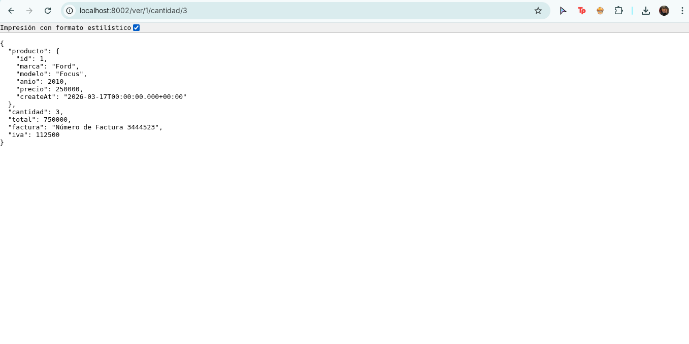

**DELETE `/delete/1` — Eliminar item vía curl:**

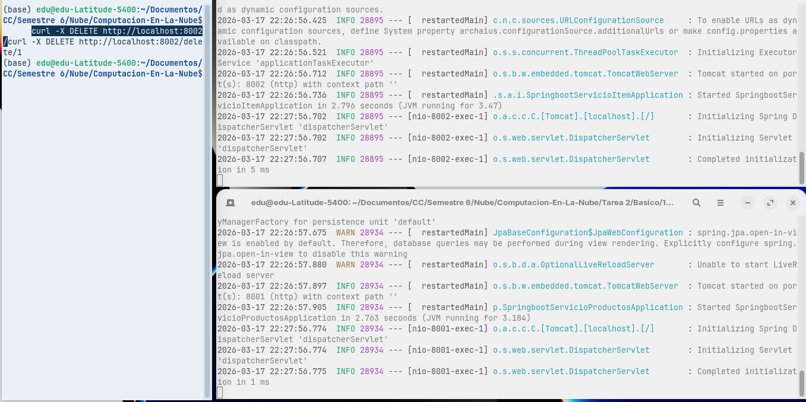

**GET `/listar` después del DELETE — El auto con id 1 ya no aparece:**

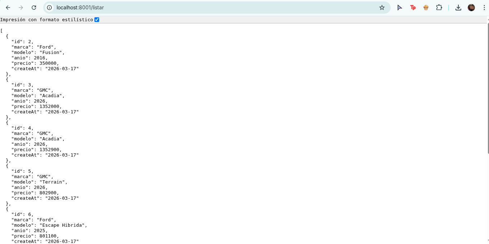

**Consola H2 — Verificación de la tabla antes del DELETE (8 filas):**

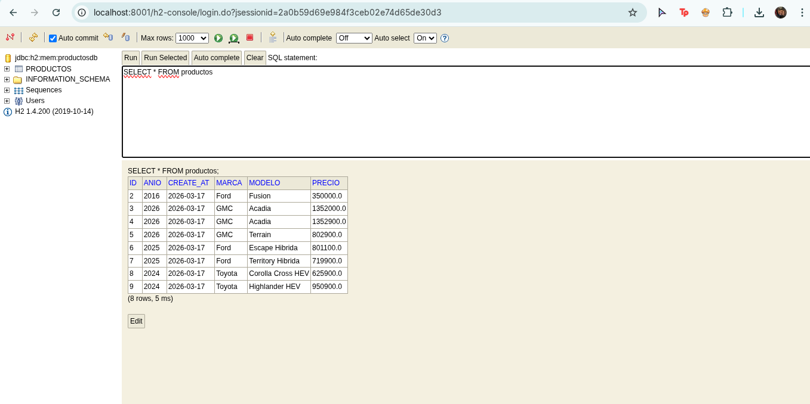

**Consola H2 — Verificación de la tabla después del DELETE (7 filas):**


